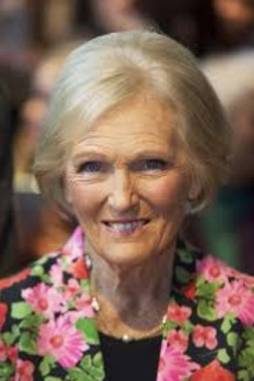

This project aims to use Tensorflow 2.0 to predict: gender - age - ethics of a face image

# UTK Dataset
UTK dataset is [here](https://susanqq.github.io/UTKFace/). The dataset has 20k+ images, each image has [age,gender,race] annotated with following format:
age_gender_race_imagename. Train set: part1/2, val set: part3.

# EDA on UTK dataset
Simple exploration gives that the UTK biases on white ethic and middle age. I decided to tackle the imbalance problem by sample_weight for each batch and weight the loss on age loss.

# Age bins
[Adience face] proposes 8 bins for age (0-2, 4-6, 8-13, 15-20, 25-32, 38-43, 48-53, 60-). There is a missing value between each bin, I defined 12 bins (0-3, 4-6, 7-12, 13-18, 19-25, 26-32, 33-38, 39-45, 46-51, 52-60, 61-70, 71-100+)


# Source structure

| Location             |  Content                                   |
|----------------------|--------------------------------------------|
| `/data`              | Unzip utk dataset to this folder           |
| `face_model.py        `   | Face multi task using pretrained inception v3        |
| `predict.py ` | Predict sample imgs |
| `predict.py ` | create_dataset.py |
| `params.json ` | Settings |

# Detail process
UTK is face in the wild, at first MTCNN face detector is applied for each image in dataset to reduce the effect of scene on model. Newly created dataset is produced after create_dataset.py

```
python create_dataset.py
```

Three heads (age, gender, races) are placed on top of InceptionV3. To use pretrained model, the backbone need to be frozen for some epochs and unfrozen for long run:

```
python face_model.py
```

After 100 epochs, accuracy in val set is [92% for gender, 80% for race, 42% for age]. The model is probably overfit on age head.

# Sample predictions
```
python predict.py --model_weights [weights]
```

GT: Female - Black - [19-25]
Pred: Female - Black - [19-25]\


GT: Female - White - [61-70]
Pred: Female - White - [61-70]\


GT: Male - Asian - [19-25]
Pred: Male - Asian - [26-32]\
